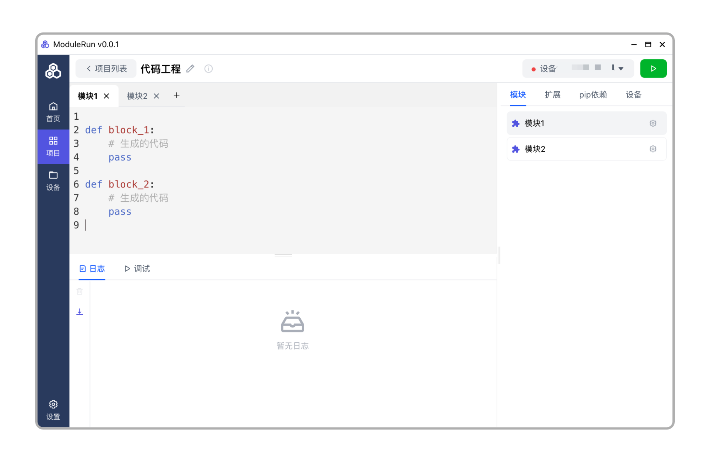

# ModuleRun


## 软件介绍

`ModuleRun` 是下一代硬件开发套件，可以理解为硬件版的 `Scratch` 开发工具，目前支持树莓派系列硬件的开发。

## 功能特点

- **模块支持** 硬件模块支持一键安装、升级、删除，支持自定义模块
- **可视化开发** 基于深度定制 `Blockly` ，以拖拉拽的方式开发
- **代码开发** 使用 `Python` 语言，支持代码高亮、代码提示、代码补全
- **并发执行** 所有模块逻辑支持并发执行，提高硬件性能
- **硬件支持** 支持树莓派全系列硬件，更多硬件支持正在适配中

> 官方文档：[https://module-run.com](https://module-run.com)

## 功能介绍

### 可视化编程


### Python编程



### 项目管理


### 设备管理


## 使用教程

### 安装Agent

Agent 是运行在硬件上的程序，用于执行硬件程序。可参照以下文档安装Agent：

- [树莓派Agent](/agent/raspberry-pi.md)

### 连接Agent

1. 进入设备界面
2. 点击 `+添加设备` 按钮
3. 输入设备 `IP` 和 `端口`，点击 `保存`

### 创建并运行项目

1. 创建项目并打开
2. 右上角选择硬件设备
3. 点击运行按钮


## 本地开发

> 基于 nodejs 20 构建

```shell
## 安装依赖
npm install
## 启动开发环境
npm run dev
## 打包
npm run build
```

## License

GPL-3.0
